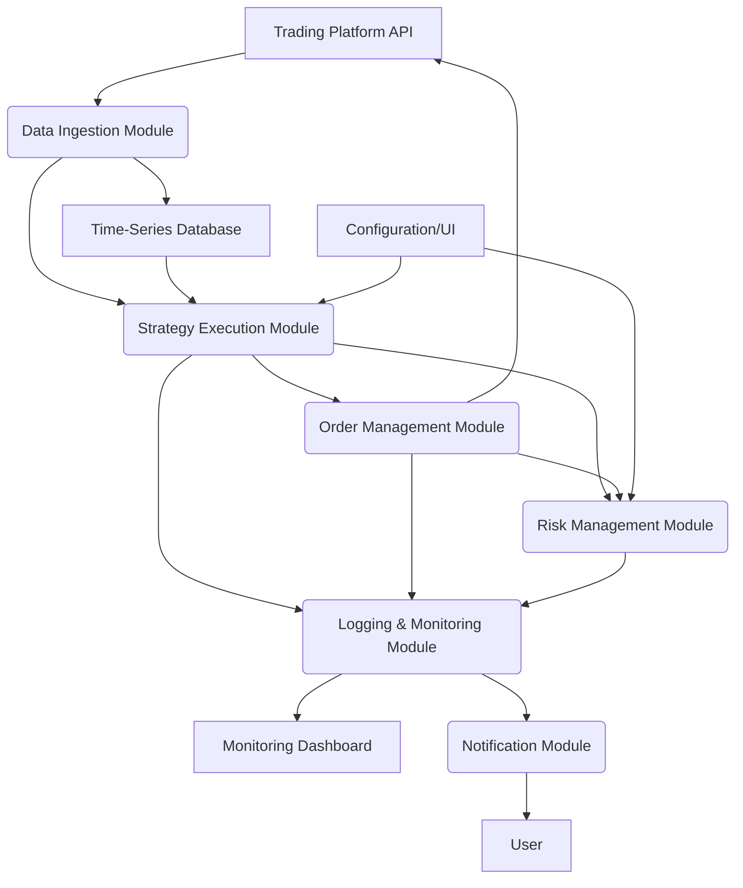

# Technology Stack Analysis and Architecture Design for Futures Trading Bot

## Introduction

Building a robust and efficient futures trading bot requires careful consideration of the underlying technology stack. This document will analyze various components, including programming languages, data storage solutions, and overall architectural design, to ensure the bot is scalable, reliable, and capable of executing complex trading strategies. The primary goal is to identify a technology stack that facilitates rapid development, seamless integration with trading platforms, and efficient processing of real-time and historical market data.

Given the user's initial query regarding JavaScript and the prevalence of Python in algorithmic trading, a detailed comparison of these languages, along with other relevant technologies, will be provided. The chosen stack will prioritize ease of development, performance, and the availability of libraries and community support for financial applications.

## Programming Language Selection

The choice of programming language is paramount for an algorithmic trading bot, as it impacts development speed, execution performance, and access to specialized libraries. Two primary candidates emerge for this project: Python and JavaScript.

### Python

Python is widely regarded as the de facto standard for quantitative finance and algorithmic trading. Its popularity stems from several key advantages:

*   **Rich Ecosystem of Libraries:** Python boasts an extensive collection of libraries specifically designed for data analysis, scientific computing, and machine learning. Libraries such as Pandas, NumPy, SciPy, and scikit-learn are invaluable for processing historical data, backtesting strategies, and implementing advanced analytical models. For financial data, libraries like `zipline`, `backtrader`, and `pyalgotrade` provide frameworks for building and testing trading strategies.
*   **Ease of Use and Readability:** Python's simple syntax and high readability contribute to faster development cycles. This is particularly beneficial for prototyping and iterating on trading strategies.
*   **Strong Community Support:** A large and active community means abundant resources, tutorials, and forums for troubleshooting and learning. Many trading platforms also offer official Python SDKs, simplifying API integration.
*   **Integration Capabilities:** Python can easily integrate with other languages and systems, allowing for hybrid solutions if specific performance bottlenecks arise.

### JavaScript

JavaScript, primarily known for web development, has gained traction in backend development with Node.js. While it offers certain advantages, its suitability for algorithmic trading, especially for complex quantitative tasks, is less established compared to Python:

*   **Asynchronous Operations:** Node.js excels in handling concurrent connections and I/O-bound operations, which can be beneficial for managing real-time market data streams.
*   **Full-Stack Development:** For developers familiar with JavaScript, it allows for a unified language across frontend (if a web interface is desired) and backend components.

However, JavaScript's limitations for this project include:

*   **Fewer Specialized Libraries:** Compared to Python, JavaScript has a less mature ecosystem of libraries for advanced statistical analysis, machine learning, and financial modeling. While some libraries exist, they may not offer the same depth or performance as their Python counterparts.
*   **Performance for Computation-Intensive Tasks:** For highly computation-intensive tasks, such as complex backtesting or real-time signal processing, JavaScript's single-threaded nature (though mitigated by asynchronous operations) might be a disadvantage compared to Python's ability to leverage multi-threading or multiprocessing for certain operations.

### Recommendation

Given the requirements for data analysis, strategy development, and the availability of robust financial libraries, **Python is the recommended programming language** for building the futures trading bot. Its ecosystem is better suited for the quantitative aspects of algorithmic trading, and platforms like Binance offer official Python SDKs, simplifying integration. While JavaScript might be suitable for certain aspects (e.g., a real-time dashboard), Python should be the core language for the trading logic and data processing.

## Data Storage and Management

Efficiently storing and managing historical and real-time market data is crucial for backtesting, strategy optimization, and live trading. The choice of database depends on the volume, velocity, and variety of data, as well as the specific access patterns required by the trading bot.

### Relational Databases (e.g., PostgreSQL, MySQL)

Relational databases are well-suited for structured data and offer strong consistency and reliability. They can be used to store:

*   **Historical Price Data:** OHLCV (Open, High, Low, Close, Volume) data for various timeframes.
*   **Trade Logs:** Records of executed trades, including entry/exit points, quantities, and profits/losses.
*   **Strategy Parameters:** Configuration settings for different trading strategies.

**Advantages:**
*   **Data Integrity:** Enforce data consistency through schemas and transactions.
*   **Complex Queries:** SQL allows for powerful and flexible querying of structured data.
*   **Maturity and Tooling:** Well-established with a wide range of management tools and community support.

**Disadvantages:**
*   **Scalability for High-Frequency Data:** May become a bottleneck for extremely high-frequency data ingestion and retrieval, especially with large volumes of tick data.

### Time-Series Databases (e.g., InfluxDB, TimescaleDB)

Time-series databases are optimized for handling data points indexed by time, making them ideal for market data.

**Advantages:**
*   **High Ingestion Rates:** Designed for efficient writing of time-stamped data.
*   **Optimized Queries:** Provide specialized functions for time-based queries, aggregations, and downsampling.
*   **Storage Efficiency:** Often employ compression techniques to reduce storage footprint for time-series data.

**Disadvantages:**
*   **Less Flexible for Non-Time-Series Data:** Not as versatile for storing highly relational or unstructured data.

### NoSQL Databases (e.g., MongoDB, Cassandra)

NoSQL databases offer flexibility and horizontal scalability, making them suitable for handling large volumes of unstructured or semi-structured data.

**Advantages:**
*   **Scalability:** Can scale out horizontally to accommodate massive data volumes.
*   **Flexibility:** Schema-less design allows for easy adaptation to changing data structures.

**Disadvantages:**
*   **Eventual Consistency:** Some NoSQL databases prioritize availability and partition tolerance over strong consistency, which might be a concern for critical trading data.
*   **Less Mature Querying:** Querying capabilities might be less expressive than SQL for complex relational data.

### Recommendation

For historical price data and trade logs, a **time-series database like TimescaleDB (an extension for PostgreSQL) or InfluxDB** would be highly beneficial due to their optimization for time-stamped data. For storing strategy parameters and other configuration data, a traditional relational database like **PostgreSQL** would be sufficient. Given the potential need for both, a hybrid approach using PostgreSQL with TimescaleDB extension could provide a good balance of structured data management and time-series optimization.

## Architectural Design Considerations

The trading bot's architecture should be modular, scalable, and resilient to ensure continuous operation and easy maintenance. A microservices-based approach or a well-defined modular monolith can be considered.

### Key Components:

*   **Data Ingestion Module:** Responsible for connecting to trading platform APIs (e.g., Binance Futures Testnet) to fetch real-time market data (tick data, OHLCV) and historical data. This module should handle API rate limits, data parsing, and data storage.
*   **Strategy Execution Module:** This is the core of the bot, where trading strategies (like the opening range breakthrough) are implemented. It will consume real-time market data, generate trading signals, and interact with the Order Management Module.
*   **Order Management Module:** Handles the placement, modification, and cancellation of orders on the trading platform. It should incorporate robust error handling, retry mechanisms, and position tracking.
*   **Risk Management Module:** Crucial for preventing catastrophic losses. This module will monitor account balance, open positions, and enforce predefined risk parameters (e.g., maximum drawdown, position size limits).
*   **Logging and Monitoring Module:** Essential for debugging, performance analysis, and auditing. It should log all significant events, trades, errors, and system health metrics. Integration with monitoring tools (e.g., Prometheus, Grafana) can provide real-time dashboards.
*   **Notification Module:** Alerts the user about important events, such as trade executions, errors, or significant market movements, via email, SMS, or messaging platforms.
*   **Configuration and UI Module (Optional):** A simple web-based or command-line interface for configuring strategies, enabling/disabling the bot, and viewing real-time performance metrics.

### High-Level Architecture (Conceptual):

This modular design allows for independent development, testing, and scaling of each component. For instance, the Data Ingestion Module can be scaled independently to handle high volumes of market data, while the Strategy Execution Module can be optimized for computational efficiency.

## Conclusion

This analysis recommends Python as the primary programming language due to its rich ecosystem for quantitative finance. A hybrid data storage approach utilizing a time-series database (e.g., TimescaleDB) for market data and a relational database (e.g., PostgreSQL) for other structured data is suggested. The proposed modular architecture emphasizes separation of concerns, scalability, and robust error handling, laying a solid foundation for building a comprehensive and reliable futures trading bot. The next phase will involve designing the core functions and implementing the opening range breakthrough strategy based on these architectural considerations.

